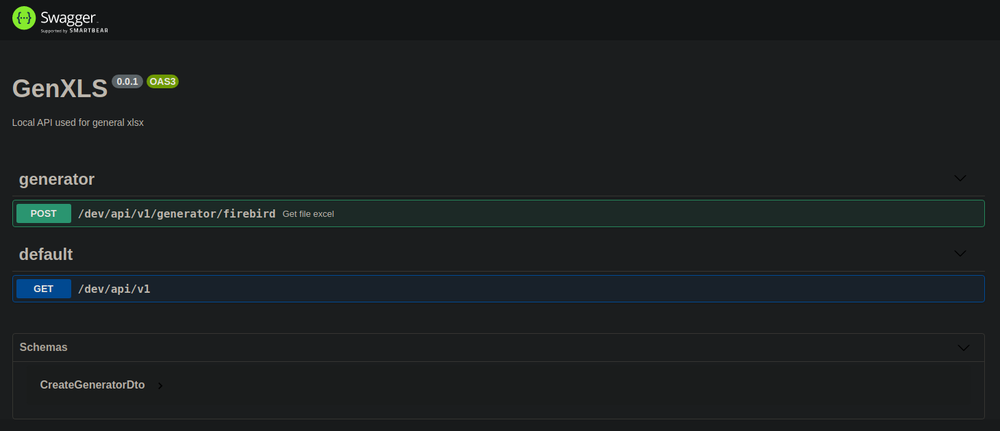

> # GenXLS
>
> ## Description
> ___
> GenXLS is a project that allows generating reports in excel based on <a href="https://nestjs.com/" target="_blank"> NestJS </a>, which seeks to facilitate the task of generating reports for developers.
> ## Getting started
> ___
> * Check the nest documentation [Guide NestJS](https://docs.nestjs.com)
> * Install docker and docker-compose and review the docker documentation [Guide docker](https://docs.docker.com/)
> * Check the firebird documentación [Guide Firebird](https://firebirdsql.org/en/reference-manuals/)
> ## Documentation with swagger
> 
> ## More execution information
> [Execute With Dockers](README_DOCKERS.md)
> ## Developers 👨‍💻🔥
> ___
>   * **Luis Ortiz @Drowlex** - *Development and Documentation* - [Drowlex](https://github.com/Drowlex)
>
>   🎉👨‍💻 _¡Sin miedo al éxito!_ 👨‍💻🎉
>
> ## License
> ___
> Nest is [MIT licensed](LICENSE).