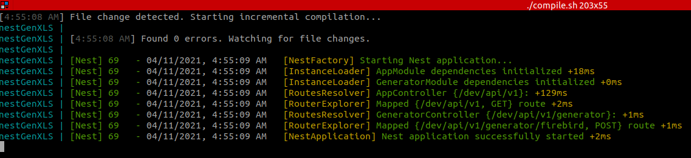

> # GenXLS
> ## Start the project with Docker 🐳
> ___
>   1. Compile docker
>       * ``` docker build -f nest.dockerfile --no-cache -t nest-GenXLS . ```
>   2. Run (tests)
>       * ``` docker run -p 8400:8400 --name test nest-GenXLS ```
>       * ``` docker run -p 8400:8400 --name test -e "NODE_ENV=start:pm2" nest-GenXLS ```
>       * ``` docker run --rm -p 8400:8400 --name test -e "NODE_ENV=start:pm2" nest-GenXLS ```
>       * ``` docker run --rm -p 8400:8400 --name test nest-GenXLS ```
>       * ``` docker run -d --rm -p 8400:8400 --name test nest-GenXLS ```
>   3. Run machine (access files)
>       * ``` docker run -it --rm nest-genxls /bin/bash ```
>   4. Access files
>       * ``` docker exec -i -t nestGenXLS bash ```
>   5. Stop service
>       * ``` docker stop test ```
>   6. Clean container
>       * ``` docker rm test ```
>   7. Check the docker in the background
>       * ```docker logs --follow nestGenXLS```
> ## Start the project with docker-compose 🐳
> ___
>   1. Start service
>       * ```docker-compose up```
>       * ```docker-compose up -d```
>       * ```docker-compose up -d {nest}```
>   2. Start service with limits
>       * ```docker-compose --compatibility up```
>   3. Turn off service
>       * ```docker-compose down -v```
>   4. Rebuild the containers
>       * ```docker-compose build```
> ## Compile with execution file
> ___
>   1. Run command in project root
>       * ```sudo chmod -R +x compile.sh```
>   2. Enter password and execute this command (The dist folder should NOT be protected! If it is, delete it!)
>       * ```./compile.sh```
> ## Running with build file
> 
> ## Developers 👨‍💻🔥
> ___
>   * **Luis Ortiz @Drowlex** - *Development and Documentation* - [Drowlex](https://github.com/Drowlex)
>
>   🎉👨‍💻 _¡Sin miedo al éxito!_ 👨‍💻🎉